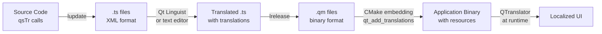

# Language System - Qt Internationalization Demo

A comprehensive Qt 6 application demonstrating dynamic language switching with Qt's internationalization (i18n) capabilities. This project showcases best practices for multi-language support in Qt applications using QML, C++, and the Qt Linguist tools.

## Table of Contents

1. [Project Overview](#project-overview)
2. [Qt Internationalization Tools](#qt-internationalization-tools)
3. [Project Architecture](#project-architecture)
4. [File Structure](#file-structure)
5. [Detailed Code Documentation](#detailed-code-documentation)
6. [Workflow and Process](#workflow-and-process)
7. [Building and Running](#building-and-running)
8. [Translation Management](#translation-management)
9. [Best Practices](#best-practices)

## Project Overview

This application demonstrates a complete internationalization system for Qt applications, supporting dynamic language switching between English, Spanish, and French. The project uses Qt's translation framework with `.ts` files and implements a singleton pattern for language management.

### Key Features

- **Dynamic Language Switching**: Change languages at runtime without restart
- **Persistent Settings**: Language preference is saved using QSettings
- **System Locale Detection**: Automatically detects and uses system language
- **Fallback Mechanism**: Graceful fallbacks when translation files are missing
- **Type-Safe Language Management**: Uses C++ enums for language codes
- **Production-Ready Error Handling**: Comprehensive error reporting and validation

## Qt Internationalization Tools

### Essential Qt i18n Components

#### 1. QTranslator
- **Purpose**: Loads and manages translation files (`.qm` files)
- **Location**: Core Qt class for runtime translation loading
- **Usage**: Installed into QCoreApplication to provide translations

#### 2. Qt Linguist Tools
- **lupdate**: Extracts translatable strings from source code to `.ts` files
- **linguist**: GUI tool for translators to edit `.ts` files
- **lrelease**: Compiles `.ts` files into binary `.qm` files for runtime use

#### 3. CMake Integration
- **qt_add_translations()**: Automatically handles `.ts` to `.qm` compilation
- **RESOURCE_PREFIX**: Embeds translations into the application binary
- **LinguistTools**: CMake component that provides translation commands

#### 4. QML Translation Functions
- **qsTr()**: Marks strings for translation in QML
- **qsTrId()**: Uses unique IDs instead of source text (alternative approach)
- **Translation Context**: Automatically uses QML component name as context

#### 5. Translation File Format (.ts)
- **XML-based**: Human-readable translation source files
- **Context System**: Groups translations by source file/class
- **Source/Translation**: Pairs original text with translated text
- **Location Tracking**: Maintains line numbers and file references

## Project Architecture

```
┌─────────────────┐    ┌──────────────────┐    ┌─────────────────┐
│   QML Frontend  │───▶│ LanguageController│───▶│  Qt Translation │
│   (Main.qml)    │    │   (Singleton)     │    │    System       │
└─────────────────┘    └──────────────────┘    └─────────────────┘
         │                        │                        │
         │                        │                        │
    ┌────▼─────┐             ┌────▼─────┐            ┌────▼─────┐
    │ UI Events│             │Language  │            │.qm Files │
    │(Buttons) │             │Validation│            │Embedded  │
    └──────────┘             └──────────┘            │Resources │
                                   │                 └──────────┘
                              ┌────▼─────┐
                              │QSettings │
                              │Persistence│
                              └──────────┘
```

### Architecture Principles

1. **Separation of Concerns**: Language logic separated from UI
2. **Singleton Pattern**: Global access to language controller
3. **Observer Pattern**: QML automatically updates via signals
4. **Type Safety**: Enums prevent invalid language codes
5. **Resource Management**: Embedded translations for deployment

## File Structure

```
LanguageSystem_/
├── CMakeLists.txt              # Build configuration with translation support
├── src/
│   ├── main.cpp                # Application entry point & setup
│   ├── Main.qml                # QML user interface
│   └── features/language/
│       ├── LanguageController.h    # Language management header
│       ├── LanguageController.cpp  # Language management implementation  
│       ├── LanguageEnum.h          # Language codes enum definition
│       └── LanguageEnum.cpp        # Language utilities implementation
├── translations/
│   ├── app_en.ts              # English translation source
│   ├── app_es.ts              # Spanish translation source
│   ├── app_fr.ts              # French translation source
│   ├── app_en.qm              # English compiled translation (generated)
│   ├── app_es.qm              # Spanish compiled translation (generated)
│   └── app_fr.qm              # French compiled translation (generated)
└── build/                     # Build output directory
```

## Detailed Code Documentation

### CMakeLists.txt

The build configuration file that sets up the Qt project with translation support.

```cmake
cmake_minimum_required(VERSION 3.16)

project(LanguageSystem VERSION 0.1 LANGUAGES CXX)

set(CMAKE_CXX_STANDARD_REQUIRED ON)

find_package(Qt6 REQUIRED COMPONENTS Quick LinguistTools)
```

**Lines 1-7**: Project setup and Qt dependency declaration
- `cmake_minimum_required(VERSION 3.16)`: Ensures modern CMake features
- `project(LanguageSystem VERSION 0.1 LANGUAGES CXX)`: Defines project name and version
- `find_package(Qt6 REQUIRED COMPONENTS Quick LinguistTools)`: Imports Qt Quick for QML and LinguistTools for translations

```cmake
qt_standard_project_setup(REQUIRES 6.8)
```

**Line 9**: Configures Qt-specific build settings and enables modern Qt features like automatic MOC processing.

```cmake
qt_add_executable(appLanguageSystem
    src/main.cpp
    src/features/language/LanguageController.cpp
    src/features/language/LanguageController.h
    src/features/language/LanguageEnum.cpp
    src/features/language/LanguageEnum.h
)
```

**Lines 11-17**: Creates the main executable target
- `qt_add_executable()`: Qt-specific executable creation with automatic Qt integration
- Lists all C++ source and header files including the new enum system files
- **LanguageEnum.cpp/h**: Essential for enum system - without these, linker errors occur ("undefined reference to Language::getAllCodes()")
- **Build Process**: CMake compiles all .cpp files to object files, then links them together

```cmake
qt_add_qml_module(appLanguageSystem
    URI LanguageSystem
    VERSION 1.0
    QML_FILES
        src/Main.qml
        RESOURCES .giattributes
)
```

**Lines 17-23**: QML module configuration
- `URI LanguageSystem`: Defines QML import name
- `VERSION 1.0`: Module version for QML imports
- `QML_FILES`: Lists QML files to include in the module

```cmake
set_target_properties(appLanguageSystem PROPERTIES
    MACOSX_BUNDLE_BUNDLE_VERSION ${PROJECT_VERSION}
    MACOSX_BUNDLE_SHORT_VERSION_STRING ${PROJECT_VERSION_MAJOR}.${PROJECT_VERSION_MINOR}
    MACOSX_BUNDLE TRUE
    WIN32_EXECUTABLE TRUE
)
```

**Lines 28-34**: Platform-specific executable properties
- `MACOSX_BUNDLE TRUE`: Creates app bundle on macOS
- `WIN32_EXECUTABLE TRUE`: Creates Windows GUI executable (not console)

```cmake
target_link_libraries(appLanguageSystem
    PRIVATE Qt6::Quick
)
```

**Lines 36-38**: Links required Qt libraries
- `Qt6::Quick`: Provides QML runtime and QtQuick components

```cmake
set(TS_FILES
    translations/app_en.ts
    translations/app_es.ts
    translations/app_fr.ts
)

qt_add_translations(appLanguageSystem TS_FILES ${TS_FILES} RESOURCE_PREFIX "/translations")
```

**Lines 41-47**: Translation system setup
- `TS_FILES`: List of translation source files
- `qt_add_translations()`: Automatically compiles `.ts` to `.qm` files and embeds them
- `RESOURCE_PREFIX "/translations"`: Sets the Qt resource path for translations

### src/main.cpp

The application entry point that initializes Qt components and the language system.

```cpp
#include <QGuiApplication>
#include <QQmlApplicationEngine>
#include <QQmlContext>
#include "features/language/LanguageController.h"
```

**Lines 1-4**: Essential Qt and project headers
- `QGuiApplication`: Core application class for GUI apps
- `QQmlApplicationEngine`: Loads and manages QML files
- `QQmlContext`: Provides C++ to QML data binding context
- `LanguageController`: Custom language management class

```cpp
int main(int argc, char *argv[])
{
    QGuiApplication app(argc, argv);
```

**Lines 6-8**: Application initialization
- Creates the main Qt application object with command-line arguments

```cpp
    // Set application properties for translation context
    app.setApplicationName("LanguageSystem");
    app.setOrganizationName("QtExample");
    app.setApplicationVersion("1.0");
```

**Lines 10-13**: Application metadata setup
- These properties are used by QSettings for persistent storage keys
- Important for translation file resolution and settings storage location

```cpp
    // Create the language controller singleton
    LanguageController languageController;
```

**Lines 15-16**: Language system initialization
- Creates the singleton instance of LanguageController
- Constructor automatically loads saved language or detects system locale

```cpp
    QQmlApplicationEngine engine;

    // Register the LanguageController instance as a context property
    engine.rootContext()->setContextProperty("LanguageController", &languageController);
```

**Lines 18-21**: QML engine setup and C++ integration
- `QQmlApplicationEngine`: Creates the QML runtime engine
- `setContextProperty()`: Exposes C++ object to QML as "LanguageController"
- This enables QML to access C++ properties and methods

```cpp
    QObject::connect(
        &engine,
        &QQmlApplicationEngine::objectCreationFailed,
        &app,
        []() { QCoreApplication::exit(-1); },
        Qt::QueuedConnection);
```

**Lines 23-28**: Error handling for QML loading failures
- Connects QML engine failure signal to application exit
- Lambda function terminates app with error code -1 if QML fails to load
- `Qt::QueuedConnection`: Ensures safe cleanup before exit

```cpp
    engine.loadFromModule("LanguageSystem", "Main");

    return app.exec();
```

**Lines 29-31**: QML loading and main event loop
- `loadFromModule()`: Loads Main.qml from the LanguageSystem QML module
- `app.exec()`: Starts the Qt event loop and returns when app quits

### src/features/language/LanguageEnum.h

Type-safe language code definitions using modern C++ best practices.

```cpp
#pragma once

#include <QString>
#include <QStringList>
```

**Lines 1-4**: Header guard and Qt string type imports
- `#pragma once`: Modern header guard (compiler-specific but widely supported)
- QString/QStringList: Qt's Unicode string classes

```cpp
namespace Language {
    enum class Code {
        English,
        Spanish,
        French
    };
```

**Lines 6-12**: Namespace and enum class definition
- `namespace Language`: Groups related language functionality
- `enum class Code`: Type-safe enumeration (C++11 feature)
- Strong typing prevents accidental integer/string conversions

```cpp
    QString toString(Code language);
    Code fromString(const QString &languageCode);
    QStringList getAllCodes();
    bool isSupported(const QString &languageCode);
```

**Lines 14-17**: Utility function declarations
- `toString()`: Converts enum to ISO language code string
- `fromString()`: Converts string to enum with validation
- `getAllCodes()`: Returns list of all supported language codes
- `isSupported()`: Validates language code without conversion

### src/features/language/LanguageEnum.cpp

Implementation of language code utilities with comprehensive validation.

```cpp
#include "LanguageEnum.h"

namespace Language {
```

**Lines 1-3**: Header inclusion and namespace opening

```cpp
QString toString(Code language)
{
    switch (language) {
    case Code::English:
        return "en";
    case Code::Spanish:
        return "es";
    case Code::French:
        return "fr";
    }
    return "en"; // Default fallback
}
```

**Lines 5-15**: Enum to string conversion
- `switch` statement ensures compile-time completeness checking
- Uses ISO 639-1 language codes ("en", "es", "fr")
- Fallback to "en" for safety (should never execute)

```cpp
Code fromString(const QString &languageCode)
{
    if (languageCode == "en") return Code::English;
    if (languageCode == "es") return Code::Spanish;
    if (languageCode == "fr") return Code::French;
    
    return Code::English; // Default fallback
}
```

**Lines 17-24**: String to enum conversion
- Sequential `if` statements for string comparison
- Default fallback to English for invalid codes
- Could be optimized with QHash for larger language sets

```cpp
QStringList getAllCodes()
{
    return QStringList() << "en" << "es" << "fr";
}
```

**Lines 26-29**: Complete language code list
- Returns all supported language codes as QStringList
- Uses Qt's stream operator (`<<`) for list construction

```cpp
bool isSupported(const QString &languageCode)
{
    return languageCode == "en" || languageCode == "es" || languageCode == "fr";
}
```

**Lines 31-34**: Language code validation
- Fast boolean check without string conversion
- More efficient than converting and comparing enums

### Enum System Workflow Explanation

The enum system replaces hardcoded strings with type-safe language management. Here's the complete workflow:

#### Problem Solved
**Before (Hardcoded Strings):**
```cpp
// LanguageController.cpp:18 (original)
m_availableLanguages << "en" << "es" << "fr";  // Magic strings, prone to typos
```

**Issues:**
- No compile-time validation
- Easy to make typos ("eng" vs "en")
- Hard to maintain when adding languages
- No central definition

#### Solution Architecture
**Type-Safe Enum Workflow:**

1. **Enum Definition** (`LanguageEnum.h`):
   ```cpp
   enum class Code { English, Spanish, French };  // Compile-time constants
   ```

2. **Conversion Functions** (`LanguageEnum.cpp`):
   ```cpp
   toString(Code::Spanish) → "es"     // Enum to ISO code
   fromString("es") → Code::Spanish   // String to enum
   getAllCodes() → ["en", "es", "fr"] // Complete list
   isSupported("es") → true           // Fast validation
   ```

3. **Integration** (`LanguageController.cpp`):
   ```cpp
   // Replaces hardcoded strings:
   m_availableLanguages = Language::getAllCodes();
   
   // Replaces manual validation:
   if (!Language::isSupported(language)) { ... }
   ```

#### Complete User Interaction Flow

```mermaid
graph TD
    A[User clicks 'Español'] --> B[QML sends 'es' string]
    B --> C[LanguageController::setCurrentLanguage('es')]
    C --> D[Language::isSupported('es')]
    D --> E[Language validation passes]
    E --> F[QSettings saves 'es']
    F --> G[loadLanguage('es')]
    G --> H[QTranslator loads :/translations/app_es.qm]
    H --> I[emit languageChanged()]
    I --> J[QML retranslateUi()]
    J --> K[UI updates to Spanish]
```

#### Build System Integration

**CMakeLists.txt Requirements:**
```cmake
qt_add_executable(appLanguageSystem
    src/features/language/LanguageEnum.cpp    # MUST include implementation
    src/features/language/LanguageEnum.h      # MUST include declaration
    # ... other files
)
```

**Build Process:**
1. **Compile Phase**: `LanguageEnum.cpp` → Object file with function implementations
2. **Link Phase**: Resolves `Language::getAllCodes()` calls from `LanguageController.cpp`
3. **Error Prevention**: Without enum files in CMakeLists.txt → "undefined reference" errors

#### Adding New Languages

**Centralized Management - Only modify enum files:**

1. **Update LanguageEnum.h**:
   ```cpp
   enum class Code { English, Spanish, French, German };  // Add German
   ```

2. **Update LanguageEnum.cpp** (all functions):
   ```cpp
   case Code::German: return "de";                    // toString()
   if (languageCode == "de") return Code::German;    // fromString()
   return QStringList() << "en" << "es" << "fr" << "de";  // getAllCodes()
   return languageCode == "en" || ... || languageCode == "de";  // isSupported()
   ```

3. **Automatic Inheritance**: LanguageController automatically supports German through `Language::getAllCodes()`

#### Type Safety Benefits

```cpp
// Compile-time safety:
Language::Code lang = Language::Code::Spanish;  ✅ Valid
Language::Code lang = Language::Code::Invalid;  ❌ Compile error

// Runtime validation:
Language::isSupported("es");     ✅ Fast O(1) check
Language::isSupported("xyz");    ✅ Returns false, no crash

// Centralized changes:
// Adding Portuguese requires changes in only 2 files (LanguageEnum.h/.cpp)
// All other code automatically inherits the new language
```

### src/features/language/LanguageController.h

Header file defining the language management singleton with Qt properties and signals.

```cpp
#pragma once

#include <QObject>
#include <QString>
#include <QTranslator>
#include <QGuiApplication>
```

**Lines 1-6**: Header guard and Qt framework includes
- `QObject`: Base class for Qt's object system (signals/slots)
- `QString`: Qt's Unicode string class
- `QTranslator`: Qt's translation file loader
- `QGuiApplication`: For translator installation

```cpp
class LanguageController : public QObject
{
    Q_OBJECT
    Q_PROPERTY(QString currentLanguage READ currentLanguage WRITE setCurrentLanguage NOTIFY currentLanguageChanged)
    Q_PROPERTY(QStringList availableLanguages READ availableLanguages CONSTANT)
```

**Lines 8-12**: Class declaration with Qt meta-object system
- `Q_OBJECT`: Enables Qt's meta-object features (signals/slots/properties)
- `Q_PROPERTY`: Exposes C++ properties to QML
- `currentLanguage`: Read/write property with change notification
- `availableLanguages`: Read-only constant property

```cpp
public:
    explicit LanguageController(QObject *parent = nullptr);
    ~LanguageController();

    QString currentLanguage() const;
    void setCurrentLanguage(const QString &language);
    QStringList availableLanguages() const;

    static LanguageController *instance();
```

**Lines 14-22**: Public interface
- `explicit`: Prevents implicit constructor conversions
- Property getter/setter methods for QML integration
- `static instance()`: Singleton pattern access method

```cpp
signals:
    void currentLanguageChanged();
    void languageChanged();
    void languageLoadFailed(const QString &language, const QString &reason);
```

**Lines 24-27**: Qt signals for event notification
- `currentLanguageChanged()`: Emitted when language property changes
- `languageChanged()`: General language change notification
- `languageLoadFailed()`: Error reporting with details

```cpp
private:
    QString initializeLanguage();
    void loadLanguage(const QString &language);
    bool tryLoadLanguage(const QString &language);

    QString m_currentLanguage;
    QTranslator *m_translator;
    QStringList m_availableLanguages;
    static LanguageController *s_instance;
```

**Lines 29-38**: Private implementation
- Helper methods for language initialization and loading
- Member variables with `m_` prefix (Qt convention)
- Static singleton instance pointer

### src/features/language/LanguageController.cpp

Comprehensive language management implementation with fallback mechanisms.

```cpp
#include "LanguageController.h"
#include "LanguageEnum.h"
#include <QCoreApplication>
#include <QGuiApplication>
#include <QSettings>
#include <QLocale>
#include <QDebug>
```

**Lines 1-7**: Include dependencies
- Custom headers: LanguageController and LanguageEnum
- Qt core classes for application management, settings, and locale detection

```cpp
LanguageController *LanguageController::s_instance = nullptr;
```

**Line 9**: Singleton instance initialization
- Static member variable definition (required in C++)

```cpp
LanguageController::LanguageController(QObject *parent)
    : QObject(parent)
    , m_translator(new QTranslator(this))
{
    s_instance = this;

    // Initialize available languages
    m_availableLanguages = Language::getAllCodes();

    // Restore saved language or detect system language
    m_currentLanguage = initializeLanguage();

    // Load the determined language
    loadLanguage(m_currentLanguage);
}
```

**Lines 11-25**: Constructor implementation
- `QObject(parent)`: Initializes Qt parent-child hierarchy
- `m_translator(new QTranslator(this))`: Creates translator with automatic cleanup
- `s_instance = this`: Registers singleton instance
- Uses enum utilities for language list initialization
- Calls helper methods for language detection and loading

```cpp
LanguageController::~LanguageController()
{
    s_instance = nullptr;
}
```

**Lines 27-30**: Destructor
- Resets singleton pointer when instance is destroyed
- QTranslator cleanup is automatic due to parent-child relationship

```cpp
LanguageController *LanguageController::instance()
{
    return s_instance;
}
```

**Lines 32-35**: Singleton access method
- Returns global instance pointer (may be nullptr if not created)

```cpp
QString LanguageController::currentLanguage() const
{
    return m_currentLanguage;
}
```

**Lines 37-40**: Current language getter
- Simple accessor for the current language code

```cpp
void LanguageController::setCurrentLanguage(const QString &language)
{
    // Validate input
    if (language.isEmpty()) {
        emit languageLoadFailed(language, "Empty language code provided");
        return;
    }

    if (!Language::isSupported(language)) {
        QString availableList = Language::getAllCodes().join(", ");
        emit languageLoadFailed(language, QString("Unsupported language. Available languages: %1").arg(availableList));
        return;
    }

    if (m_currentLanguage == language) {
        qDebug() << "Language" << language << "is already current";
        return; // Already current language
    }

    // Attempt to load the language
    m_currentLanguage = language;

    // Save to persistent settings
    QSettings settings;
    settings.setValue("language", language);

    // Try to load the language
    loadLanguage(language);

    // Always emit signals since loadLanguage handles fallbacks
    emit currentLanguageChanged();
    emit languageChanged();
}
```

**Lines 42-74**: Language setter with comprehensive validation
- **Lines 44-48**: Empty string validation with error signal
- **Lines 50-54**: Language support validation using enum utilities
- **Lines 56-59**: Redundant change prevention
- **Lines 61-62**: Update internal state
- **Lines 64-66**: Persistent storage using QSettings
- **Lines 68-73**: Load translation and emit change notifications

```cpp
QStringList LanguageController::availableLanguages() const
{
    return m_availableLanguages;
}
```

**Lines 76-79**: Available languages getter
- Returns the cached list of supported languages

```cpp
QString LanguageController::initializeLanguage()
{
    // Try to restore saved language preference
    QSettings settings;
    QString savedLanguage = settings.value("language").toString();

    if (!savedLanguage.isEmpty() && Language::isSupported(savedLanguage)) {
        qDebug() << "Restored saved language:" << savedLanguage;
        return savedLanguage;
    }

    // Fallback to system locale detection
    QString systemLocale = QLocale::system().name().left(2); // "es", "fr", etc.

    if (Language::isSupported(systemLocale)) {
        qDebug() << "Using system language:" << systemLocale;
        return systemLocale;
    }

    // Final fallback to English
    qDebug() << "Using default language: en";
    return "en";
}
```

**Lines 81-103**: Multi-level language initialization
- **Lines 84-90**: Attempts to restore previously saved language preference
- **Lines 92-98**: Falls back to system locale detection
- **Lines 100-102**: Final fallback to English as universal default
- Uses enum validation at each step

```cpp
void LanguageController::loadLanguage(const QString &language)
{
    // Try requested language first
    if (tryLoadLanguage(language)) {
        return;
    }

    // Fallback to system language if different from requested
    QString systemLang = QLocale::system().name().left(2);
    if (language != systemLang && tryLoadLanguage(systemLang)) {
        qWarning() << "Requested language" << language << "failed, using system language" << systemLang;
        m_currentLanguage = systemLang; // Update current language to reflect reality
        emit currentLanguageChanged();
        return;
    }

    // Final fallback to English
    if (language != "en" && tryLoadLanguage("en")) {
        qWarning() << "Language" << language << "failed, falling back to English";
        m_currentLanguage = "en"; // Update current language to reflect reality
        emit currentLanguageChanged();
        return;
    }

    // Critical error - log and continue without translator
    qCritical() << "All language fallbacks failed for:" << language;
}
```

**Lines 105-131**: Cascading fallback language loading
- **Lines 107-110**: Attempts to load requested language
- **Lines 112-119**: Falls back to system language if different
- **Lines 121-127**: Final fallback to English
- **Lines 129-130**: Critical error logging if all fallbacks fail
- Updates internal state when fallbacks are used

```cpp
bool LanguageController::tryLoadLanguage(const QString &language)
{
    // Remove the old translator
    QCoreApplication::removeTranslator(m_translator);

    // Use clean resource path from Qt translation system
    QString resourcePath = QString(":/translations/app_%1.qm").arg(language);

    if (m_translator->load(resourcePath)) {
        QCoreApplication::installTranslator(m_translator);
        qDebug() << "Successfully loaded language:" << language << "from" << resourcePath;
        return true;
    }

    qDebug() << "Failed to load language file:" << resourcePath;
    return false;
}
```

**Lines 133-149**: Low-level translation file loading
- **Line 135**: Removes current translator from Qt application
- **Line 138**: Constructs Qt resource path for translation file
- **Lines 140-144**: Attempts to load translation file and install it
- **Lines 146-147**: Logs failure and returns false for fallback handling

### src/Main.qml

QML user interface implementing automatic retranslation and dynamic language switching.

```qml
import QtQuick
import QtQuick.Controls

ApplicationWindow {
    id: window
    width: 600
    height: 400
    visible: true
    title: qsTr("Simple Language System Demo")
```

**Lines 1-9**: QML imports and window setup
- `import QtQuick`: Core QML types (Rectangle, Text, etc.)
- `import QtQuick.Controls`: UI controls (Button, ApplicationWindow, etc.)
- `ApplicationWindow`: Provides native window with title bar
- `qsTr()`: Marks string for translation

```qml
    // Automatic retranslation properties - Production Version
    property string welcomeTitle: qsTr("Welcome to Language System")
    property string greetingMessage: qsTr("Hello! This is a simple language system demonstration.")
    property string descriptionMessage: qsTr("Click any language button above to see the interface change language. This demonstrates Qt's internationalization capabilities.")
    property string currentLanguageLabel: qsTr("Current language: %1")
    property string englishButton: qsTr("English")
    property string spanishButton: qsTr("Español")
    property string frenchButton: qsTr("Français")
```

**Lines 11-18**: String properties for automatic retranslation
- Each UI string is stored as a property
- Properties are updated when language changes
- `%1` is a placeholder for argument substitution

```qml
    // Auto-retranslate when language changes - Production Version
    function retranslateUi() {
        welcomeTitle = qsTr("Welcome to Language System")
        greetingMessage = qsTr("Hello! This is a simple language system demonstration.")
        descriptionMessage = qsTr("Click any language button above to see the interface change language. This demonstrates Qt's internationalization capabilities.")
        currentLanguageLabel = qsTr("Current language: %1")
        englishButton = qsTr("English")
        spanishButton = qsTr("Español")
        frenchButton = qsTr("Français")
    }
```

**Lines 20-29**: Manual retranslation function
- Called when language changes to update all string properties
- Necessary because `qsTr()` doesn't automatically update at runtime
- Production-ready approach for dynamic translation

```qml
    Column {
        anchors.fill: parent
        anchors.margins: 20
        spacing: 30

        // Title
        Text {
            id: titleText
            width: parent.width
            text: window.welcomeTitle
            font.pixelSize: 24
            font.bold: true
            horizontalAlignment: Text.AlignHCenter
        }
```

**Lines 31-44**: Main layout and title
- `Column`: Vertical layout container
- `anchors.fill: parent`: Fills entire window
- `Text` element bound to property for automatic updates

```qml
        // Language buttons
        Row {
            anchors.horizontalCenter: parent.horizontalCenter
            spacing: 20

            Button {
                id: english
                text: window.englishButton
                onClicked: {
                    console.log("Clicked English")
                    LanguageController.currentLanguage = "en"
                }
            }

            Button {
                id: spanish
                text: window.spanishButton
                onClicked: {
                    console.log("Clicked Spanish")
                    LanguageController.currentLanguage = "es"
                }
            }

            Button {
                id: french
                text: window.frenchButton
                onClicked: {
                    console.log("Clicked French")
                    LanguageController.currentLanguage = "fr"
                }
            }
        }
```

**Lines 46-77**: Language selection buttons
- `Row`: Horizontal layout for buttons
- Each button calls C++ LanguageController setter
- `console.log()`: Debug output for user interaction tracking

```qml
        // Content
        Column {
            width: parent.width
            spacing: 20

            Text {
                id: greetingText
                width: parent.width
                text: window.greetingMessage
                font.pixelSize: 16
                wrapMode: Text.WordWrap
            }

            Text {
                id: descriptionText
                width: parent.width
                text: window.descriptionMessage
                font.pixelSize: 14
                wrapMode: Text.WordWrap
            }
        }
```

**Lines 79-99**: Main content area
- Nested `Column` for text content
- `wrapMode: Text.WordWrap`: Handles long text gracefully
- Text bound to translatable properties

```qml
        // Current language display
        Text {
            id: currentLanguageText
            anchors.horizontalCenter: parent.horizontalCenter
            text: window.currentLanguageLabel.arg(LanguageController.currentLanguage.toUpperCase())
            font.pixelSize: 12
        }
```

**Lines 101-107**: Current language indicator
- `.arg()`: String argument substitution (equivalent to QString::arg())
- `.toUpperCase()`: String formatting for display
- Direct binding to C++ property

```qml
    // Automatic retranslation on language change - Production Version
    Connections {
        target: LanguageController
        function onLanguageChanged() {
            console.log("Language changed signal received - auto-retranslating")
            window.retranslateUi()
        }

        function onLanguageLoadFailed(language, reason) {
            console.error("Language load failed:", language, "-", reason)
            // In production, you might show a popup or status message to user
        }
    }
```

**Lines 110-122**: Signal handling for language changes
- `Connections`: QML element for connecting to C++ signals
- `onLanguageChanged()`: Automatically calls retranslateUi() function
- `onLanguageLoadFailed()`: Handles error cases with logging
- Production-ready error handling infrastructure

### Translation Files (.ts)

Qt Linguist source files containing translatable strings and their translations.

#### app_en.ts Structure
```xml
<?xml version="1.0" encoding="utf-8"?>
<!DOCTYPE TS>
<TS version="2.1" language="en" sourcelanguage="en">
<context>
    <name>Main</name>
    <message>
        <location filename="../src/Main.qml" line="9"/>
        <source>Simple Language System Demo</source>
        <translation type="unfinished"></translation>
    </message>
</context>
</TS>
```

**XML Structure Explanation**:
- `<?xml version="1.0" encoding="utf-8"?>`: Standard XML declaration
- `<TS version="2.1" language="en" sourcelanguage="en">`: Translation set root with version and language
- `<context><name>Main</name>`: Groups translations by QML component/C++ class
- `<message>`: Individual translatable string
- `<location filename="../src/Main.qml" line="9"/>`: Source file location
- `<source>`: Original text from source code
- `<translation type="unfinished">`: Translation text (empty for English base)

## Workflow and Process

### 1. Development Workflow

```mermaid
graph TD
    A[Write QML/C++ Code] --> B[Mark Strings with qsTr()]
    B --> C[Run lupdate] 
    C --> D[Generate/Update .ts Files]
    D --> E[Translate in Qt Linguist]
    E --> F[CMake Build Process]
    F --> G[Auto-compile .ts to .qm]
    G --> H[Embed in Binary]
    H --> I[Deploy Application]
```

### 2. Translation Process

1. **String Extraction**: `lupdate` scans source files for `qsTr()` calls
2. **Translation**: Linguist GUI or direct XML editing of `.ts` files
3. **Compilation**: `lrelease` or CMake converts `.ts` to binary `.qm` files
4. **Runtime Loading**: `QTranslator` loads appropriate `.qm` file
5. **Dynamic Switching**: Controller manages translator swapping

### 3. Runtime Language Switching Sequence

```
User Clicks Button → QML onClicked → LanguageController.setCurrentLanguage()
                                    ↓
Validation → Language Loading → QSettings Save → Signal Emission
                ↓                                      ↓
Qt Translation System ← Install New QTranslator ← QML Connections
                ↓                                      ↓
UI Updates Automatically ← retranslateUi() ← onLanguageChanged()
```

### 4. Fallback Chain

1. **User Selection**: Requested language from UI
2. **System Locale**: OS language if available
3. **English Default**: Universal fallback
4. **No Translation**: Continue with source strings

## Qt Translation Tools Workflow

### Complete Translation Command Flow

#### 1. Extract Translatable Strings (lupdate)

```bash
# Extract all translatable strings from source files to .ts files
lupdate src/ -ts translations/app_en.ts translations/app_es.ts translations/app_fr.ts

# Alternative: Update specific files
lupdate src/Main.qml src/main.cpp src/features/language/ -ts translations/app_es.ts

# Recursive scan with file patterns
lupdate src/ -ts translations/app_*.ts

# With verbose output for debugging
lupdate -verbose src/ -ts translations/app_en.ts

# Update only, don't create new entries
lupdate -no-obsolete src/ -ts translations/app_es.ts
```

**What lupdate does:**
- Scans source files for `qsTr()`, `tr()`, and other translation functions
- Extracts source strings and their locations
- Updates existing `.ts` files with new/changed strings
- Preserves existing translations
- Marks removed strings as obsolete

#### 2. Translate Strings (Qt Linguist)

```bash
# Open Qt Linguist GUI for translation
linguist translations/app_es.ts

# Open multiple translation files
linguist translations/app_es.ts translations/app_fr.ts

# Batch open all translation files
linguist translations/app_*.ts
```

**Qt Linguist GUI Features:**
- **Context View**: Shows source file and line number
- **Translation Editor**: Side-by-side source/translation editing
- **Phrase Books**: Reusable translation glossaries
- **Validation**: Checks for missing translations and formatting issues
- **Search/Replace**: Find and replace across translations
- **Statistics**: Translation completion progress

**Alternative: Direct XML Editing**
```xml
<!-- Edit .ts files directly in text editor -->
<message>
    <location filename="../src/Main.qml" line="12"/>
    <source>Welcome to Language System</source>
    <translation>Bienvenido al Sistema de Idiomas</translation>
</message>
```

#### 3. Compile Translations (lrelease)

```bash
# Compile single .ts file to .qm
lrelease translations/app_es.ts

# Compile all .ts files
lrelease translations/app_*.ts

# Compile with verbose output
lrelease -verbose translations/app_es.ts

# Remove untranslated strings from .qm files
lrelease -removeidentical translations/app_es.ts

# Compress .qm files (default behavior)
lrelease -compress translations/app_es.ts

# Output to specific directory
lrelease translations/app_es.ts -qm build/translations/app_es.qm
```

**What lrelease does:**
- Converts human-readable `.ts` files to binary `.qm` files
- Optimizes file size and loading speed
- Validates translation format consistency
- Creates deployment-ready translation files

#### 4. Complete Workflow Commands

```bash
# Step 1: Extract new/changed strings
lupdate src/ -ts translations/app_en.ts translations/app_es.ts translations/app_fr.ts

# Step 2: Open translator interface
linguist translations/app_es.ts

# Step 3: Compile after translation
lrelease translations/app_es.ts

# Step 4: Verify compiled file
ls -la translations/app_es.qm

# Optional: Test translation loading
# (This is handled automatically by CMake in our project)
```

#### 5. Advanced lupdate Options

```bash
# Include only specific file extensions
lupdate -extensions cpp,h,qml src/ -ts translations/app_es.ts

# Exclude certain directories
lupdate src/ -ts translations/app_es.ts -no-recursive

# Set source language explicitly
lupdate -source-language en_US -target-language es_ES src/ -ts translations/app_es.ts

# Generate locations with line numbers
lupdate -locations absolute src/ -ts translations/app_es.ts

# Disable location information (smaller files)
lupdate -locations none src/ -ts translations/app_es.ts
```

#### 6. Qt Linguist Command Line Options

```bash
# Open with specific UI language
linguist -ui-language es translations/app_es.ts

# Load phrase book automatically
linguist -phrasebook phrases_es.qph translations/app_es.ts

# Start with specific translation selected
linguist translations/app_es.ts -translate "Welcome message"
```

#### 7. Advanced lrelease Options

```bash
# Generate statistics during compilation
lrelease -verbose translations/app_es.ts

# Mark all entries as finished (development use)
lrelease -markuntranslated "-UNTRANSLATED-" translations/app_es.ts

# Silent compilation (no output unless errors)
lrelease -silent translations/app_es.ts

# Include source text for debugging
lrelease -idbased translations/app_es.ts
```

### Translation File Lifecycle



## Building and Running

### Prerequisites

- Qt 6.8 or later
- CMake 3.16 or later
- Qt Linguist Tools (lupdate, lrelease, linguist)
- C++17 compiler

### Build Commands

```bash
# Configure build
cmake -B build -S .

# Build project (automatically runs lrelease via CMake)
cmake --build build

# Run executable
./build/appLanguageSystem

# Windows
./build/Debug/appLanguageSystem.exe
```

### Manual Translation Workflow (Alternative to CMake)

```bash
# 1. Extract strings
lupdate src/ -ts translations/app_en.ts translations/app_es.ts translations/app_fr.ts

# 2. Translate (repeat for each language)
linguist translations/app_es.ts
linguist translations/app_fr.ts

# 3. Compile translations
lrelease translations/app_en.ts
lrelease translations/app_es.ts  
lrelease translations/app_fr.ts

# 4. Verify .qm files created
ls translations/*.qm

# 5. Build application
cmake --build build
```

### CMake Translation Integration

The `qt_add_translations()` command automatically:
1. Compiles `.ts` files to `.qm` during build (equivalent to `lrelease`)
2. Embeds `.qm` files as Qt resources
3. Makes translations available at runtime via `:/translations/` prefix
4. Handles dependencies so translations rebuild when `.ts` files change

## Translation Management

### Adding New Languages

1. **Update LanguageEnum.h**:
```cpp
enum class Code {
    English,
    Spanish,
    French,
    German  // Add new language
};
```

2. **Update LanguageEnum.cpp**:
```cpp
// Add to all utility functions
QString toString(Code language) {
    // Add case for German
}
```

3. **Add Translation File**:
```bash
# Create new .ts file
lupdate src/ -ts translations/app_de.ts
```

4. **Update CMakeLists.txt**:
```cmake
set(TS_FILES
    translations/app_en.ts
    translations/app_es.ts
    translations/app_fr.ts
    translations/app_de.ts  # Add new file
)
```

### Updating Existing Translations

```bash
# Extract new/changed strings
lupdate src/ -ts translations/app_*.ts

# Open in Qt Linguist for translation
linguist translations/app_es.ts
```

## Best Practices

### 1. String Management
- Use `qsTr()` consistently in QML
- Avoid hardcoded strings in C++
- Use string properties for dynamic retranslation
- Implement placeholder arguments with `%1`, `%2`, etc.

### 2. Architecture Patterns
- Singleton for global language access
- Observer pattern for UI updates
- Type-safe enums for language codes
- Comprehensive fallback mechanisms

### 3. Error Handling
- Validate language codes before loading
- Implement graceful fallbacks
- Log translation failures
- Provide user feedback for errors

### 4. Performance Considerations
- Cache translated strings when possible
- Minimize retranslation frequency
- Use embedded resources for deployment
- Lazy-load translation files if needed

### 5. Testing Strategy
- Test all language combinations
- Verify fallback mechanisms
- Test UI layout with longer translations
- Validate settings persistence

### 6. Deployment
- Embed translations as Qt resources
- Include all `.qm` files in binary
- Test resource path resolution
- Verify cross-platform compatibility

This comprehensive documentation covers every aspect of the Qt Language System, from low-level implementation details to high-level architectural decisions, providing a complete reference for understanding and extending the internationalization capabilities of Qt applications.